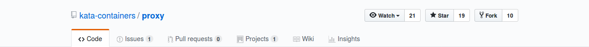
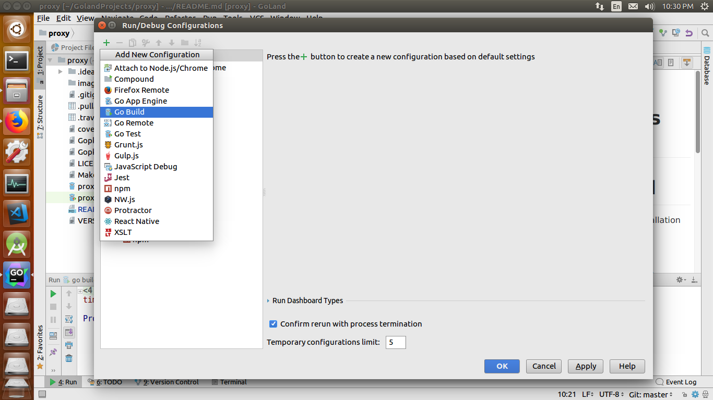
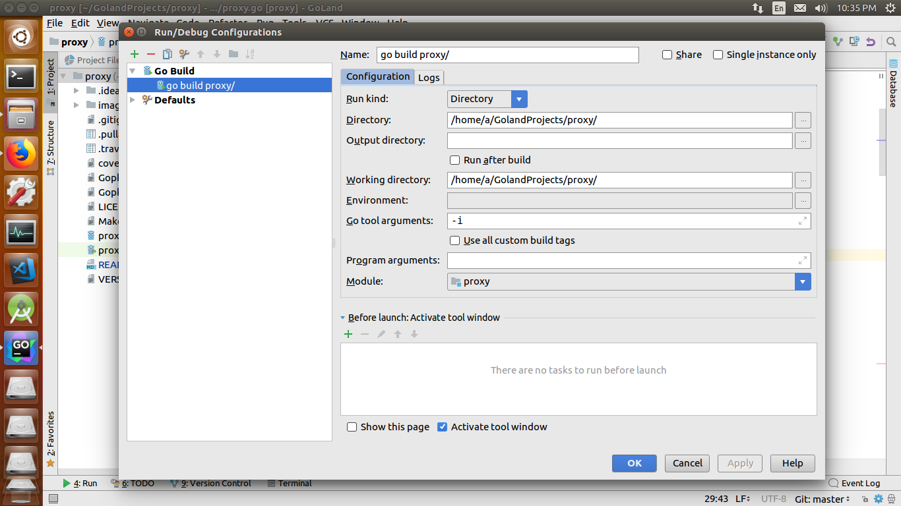
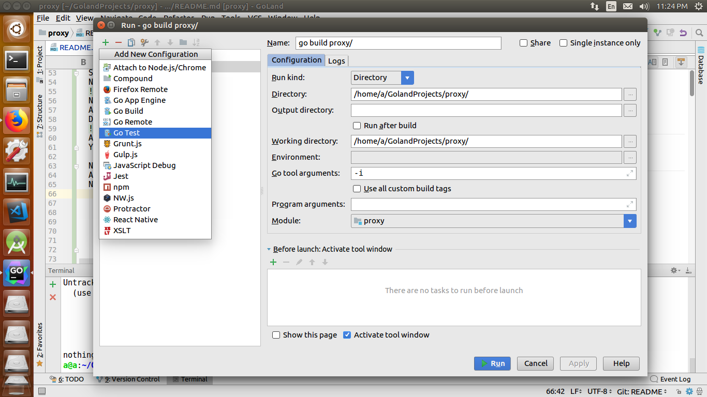
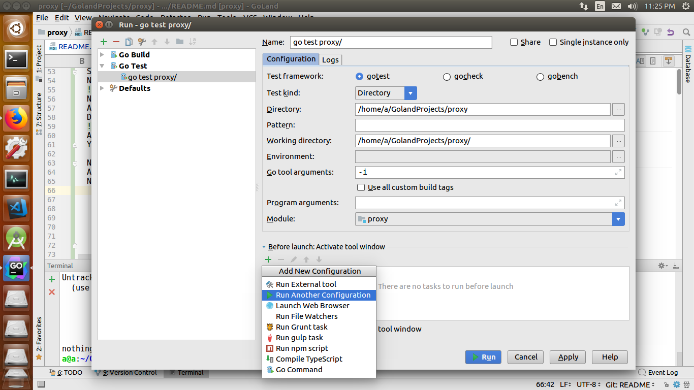
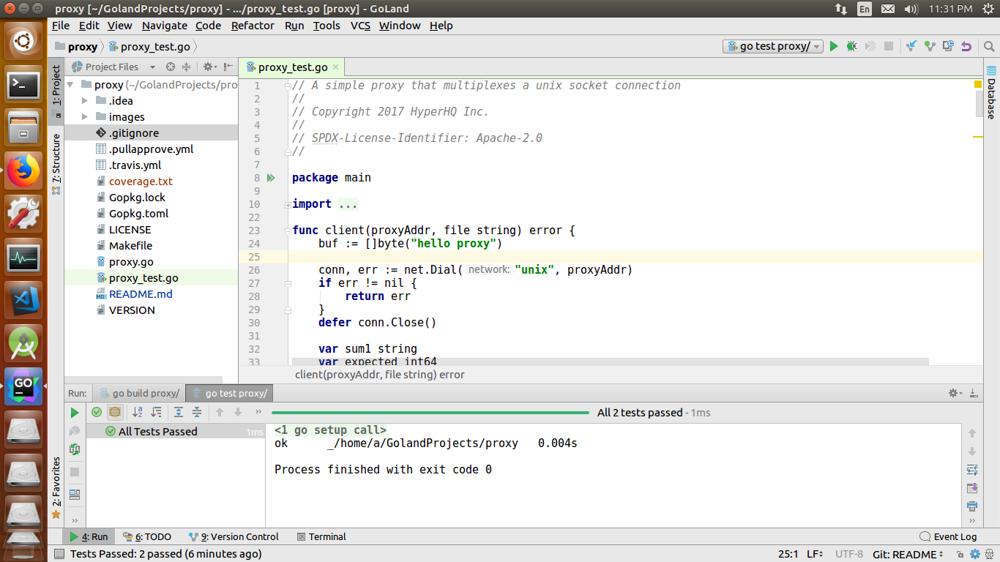

Note : This project uses git for version control.

If you are new to git, please chekout these resources.

1. [git-the-missing-tutorial](https://github.com/shekhargulati/git-the-missing-tutorial)
1. [git-tutorial](http://api.coala.io/en/latest/Developers/Git_Basics.html)
        

## Getting Started

This guide assumes you have a working installation of Golang.

### Get The Source

First fork this repo

To do this click on the fork button on the top

Once you have successfully forked the repo, clone it on your computer

To do this execute
 
    git clone https://github.com/<your-username>/proxy.git

Now you will have a local copy of the repo on your computer

Now add the original repo as a remote

    cd proxy
    git remote  add upstream  https://github.com/kata-containers/proxy.git

If you haven't installed the dependencies already, install them using

    go get github.com/hashicorp/yamux
    go get github.com/sirupsen/logrus

## Build 

### Using Terminal

To build the project from the terminal type

    make

To run unit tests run

    make test

To remove all generated output files run

    make clean

### Using GoLand

If you are using an IDE such as GoLand please follow the below steps

1. Open the directory of the project in Goland.

1. To  build and test the project we need to create a run configuration

Select Run -> "Edit configurations" from the menu bar

Now add a go build configuration

Now set the name and set run kind to directory.

Also check that the woking and output directories are correct.

Disable run after build.
           

After this click on OK to save changes.

You have successfully created the build configuration.

Now create the test config.

Again select Run -> Edit configurations from the menu bar.

Now add a go build configuration.

    
Now set the name. Set test kind to directory.

Also check that the woking and output directories are correct.

Select before launch run another configuration option as shown here.

Then select the name of the build config.

Build config is being ececuted before tests just to make our life easier.

Feel free to uncheck this if you want.
 

After this click on run to save changes.

If you have done all this right you should see something similar to this

You have successfully created the test configuration.

Now to again build and test the project select
 
Run->"go test proxy/" or use < shift > + F10.

## Hack!!

Create a separate branch for each issue using
    
    git checkout -b <new-branch-name>
    
make changes to the code.

Format your code using gofmt 
(or using < shift > + < ctrl > + < alt > + P in GoLand)

When you are done commit and push to your repo.

    git add .
    git commit -am "your commit message"
    git push origin <branch-name>

Now issue a pull request for your code to be merged.

